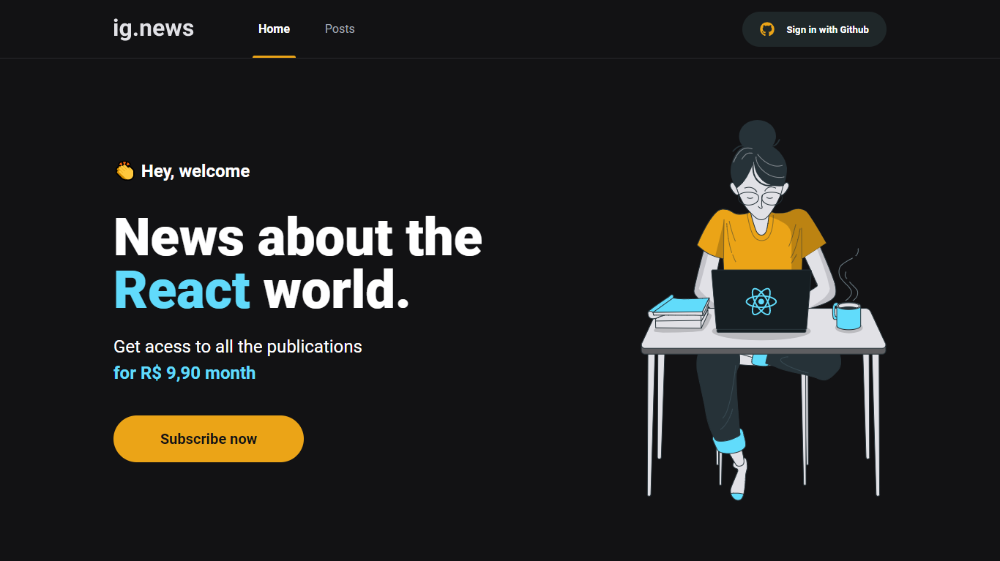

  <h1>:rocket: ig.news  </h1>
  <h2>Projeto Ignite Trilha React</h2>
  
O projeto tem como objetivo o estudo e desenvolvimento de uma aplicação em ReactJS com NextJS para listagem de posts e sistema de inscrição(subscription).

  
A aplicação foi desenvolvida utilizando o framework NextJS aplicando conceitos como consumo de API externas, API Root, Server Side Rendering (SSR), Static Site Generation (SSG), STRIPE para pagamentos das subscriptions, NextAuth para autenticação com Github, FaunaDB para armazenar as informações do usuário em um banco de dados e Prismic CMS para adição e gerenciamento do conteúdo dos posts.

## Tecnologias

- [ReactJS](https://reactjs.org/)
- [NextJS](https://nextjs.org/)
- [TypeScript](https://www.typescriptlang.org/)
- [SASS](https://sass-lang.com/)
- [Next-Auth](https://next-auth.js.org/)
- [Stripe](https://stripe.com/)
- [FaunaDB](https://fauna.com/)
- [Prismic CMS](https://prismic.io/)

## Giving feedback

Feedback é sempre bem-vindo, se você tiver qualquer sugestão ou duvida por favor me enviar um e-mail: gcgonzalez99@hotmail.com
